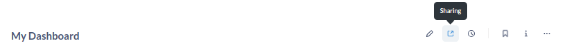
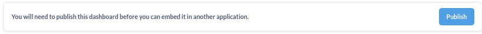

# Metabase Static Embedding Example (Next.js)


Before embedding, remember to publish your dashboard by following these steps:

1. Click on "Sharing" icon:

   

2. Select "Embed" option:

   

3. Click on "Publish" button:

   

## Configuring Environment Variables

Create a `.env` file in the root of your project with the following content:

```bash
METABASE_SITE_URL=http://localhost:3000
METABASE_SECRET_KEY=<YOUR_METABASE_SECRET_KEY>
```

## Getting Started

First, install the dependencies by running:

```bash
npm install
```

Then, run the development server:

```bash
npx next dev
```

Open [http://localhost:3000](http://localhost:3000) with your browser to see the result.

## Updating Payload

Update `page.tsx` with your dashboard payload. You can see it on the embedding page.

Example:

```typescript
const payload = {
    resource: { dashboard: 2 },
    params: {},
    exp: Math.round(Date.now() / 1000) + (10 \* 60) // 10 minute expiration
};
```

## Licensing

This project is licensed under the MIT License. See the LICENSE file for more details.
